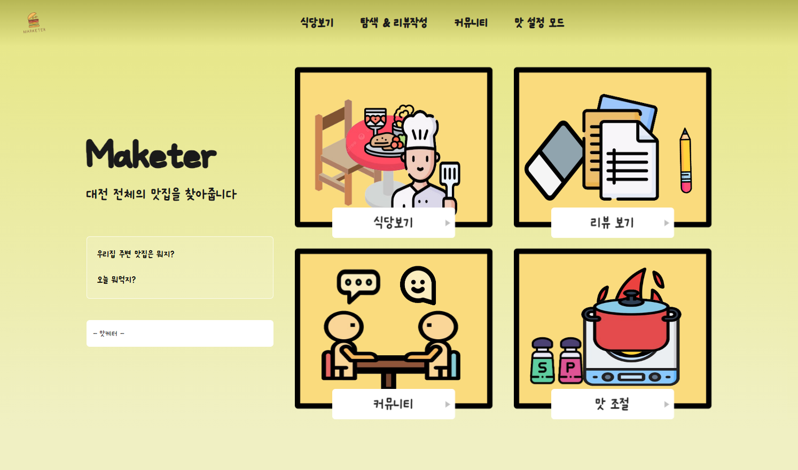
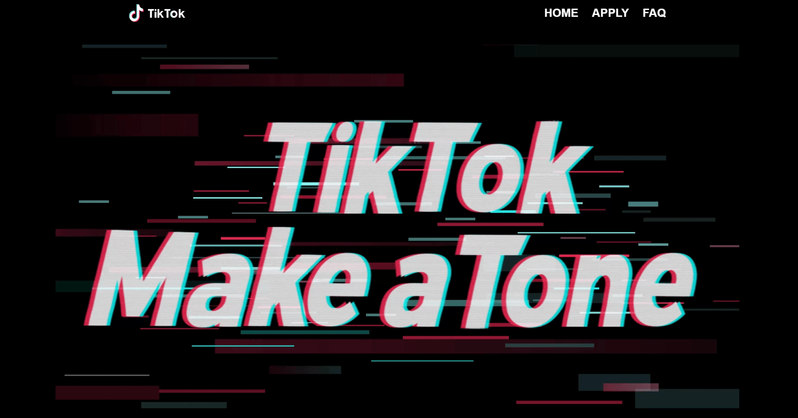

  <h1>My GitHub Projects</h1>

  

    

      
      

        <h2 class="project-title">맛집 사이트</h2>
        
사용자가 원하는 입맛의 식당을 검색 및 찾아 볼 수 있다.

        
사용기술: React, Node.js, Postgre

        <a class="project-link" href="https://github.com/dong5397/TesteMarketer-app">View Repository</a>
      

    

    

      
      

        <h2 class="project-title">TikTok</h2>
        
틱톡 AR필터 모집 공고 제작

        
사용기술: React, Node.js, Postgre

        <a class="project-link" href="https://github.com/dong5397/TicTok5397">View Repository</a>
      

    

  

---
